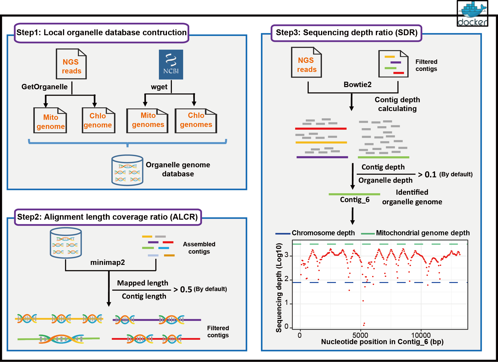

# Chlomito
Chlomito: a novel tool for precise elimination of organelle genome contamination in nuclear genome assemblies

- [Overview](#overview)
- [System Requirements](#system-requirements)
- [Installation Guide](#installation-guide)
- [Examples](#examples)
- [License](#license)

  

# Overview
Accurate genome assemblies are crucial for understanding biological evolution, mechanisms of disease, and biodiversity. However, contamination from organelle genomes in nuclear genome analyses often leads to inaccuracies and unreliability in results. To address this issue, we developed a tool named Chlomito, which employs innovative algorithms to precisely identify and eliminate organelle genome contamination sequences from nuclear genome assemblies. Compared to conventional approaches, Chlomito can not only detect and eliminate organelle sequences but also effectively distinguish true organelle sequences from those transferred into the nucleus via horizontal gene transfer.  

To address the challenge of accurately identifying organelle genome sequences from genomic assemblies, we propose a novel solution in this study. Our approach specifically employs two core metrics: the alignment length coverage ratio(ALCR) and the sequencing depth ratio(SDR) to enhance the identification accuracy. The ALCR refers to the proportion of a contig’s length that aligns with the organelle reference genome relative to the total length of the contig. This metric can help differentiate contigs that contain only small fragments of organelle DNA, which may arise from horizontal gene transfer, as these fragments usually constitute only a small portion of the total contig length. Therefore, a low ALCR may indicate that the contig belongs to the nuclear genome rather than the organelle genome.  Meanwhile, the SDR refers to the ratio of each coting’s sequencing depth to the average sequencing depth of the organelle genome. Given that organelle genomes exist in multiple copies within a cell, they typically exhibit higher sequencing depths than nuclear genome. Therefore, a contig with a high sequencing depth ratio, similar to the average of the organelle genome, is more likely to be a part of the organelle genome. By combining these two metrics, we can significantly improve the accuracy of identifying and removing organelle genome sequences from genome assembly data.

In summary, the development of Chlomito provides an accurate and effective solution for identifying and removing organelle DNA fragments from genome assembly contigs, holding significant value in improving the quality of chromosome assembly and deepening our understanding of the complex interactions between organelle and nuclear genomes.  ```Chlomito``` can be installed on Linux from Docker Hub.




# System Requirements

## Hardware requirements
All tests were performed on an Ubuntu Linux 18.04.3 server equipped with two Intel Xeon processors (16 cores each, 48 threads total), 512 GB of RAM, and an additional 10TB of hard drive storage. For species with large genome sizes or those with a large volume of sequencing data, more memory and storage space may be required.

## Software requirements
Before using Chlomito, it is necessary to install Docker on the Linux system. The installation method for Docker can be found at this link: https://docs.docker.com/engine/install/.


# Installation Guide

### Install from Docker

```
sudo su

docker pull songweidocker/chlomito:v1
```


# Examples
- **Help Information**

  ```
  docker run --rm -v /var/run/docker.sock:/var/run/docker.sock  -v $(pwd):/data  -w /data  songweidocker/chlomito:v1  chlomito --help
  usage: chlomito [-h] -species {animal,plant,fungi} -raw_genome RAW_GENOME
                  -NGS_1 NGS_1 -NGS_2 NGS_2 -output OUTPUT
                  [-mito_ALCR_cutoff MITO_ALCR_CUTOFF]
                  [-mito_SDR_cutoff MITO_SDR_CUTOFF]
                  [-chlo_ALCR_cutoff CHLO_ALCR_CUTOFF]
                  [-chlo_SDR_cutoff CHLO_SDR_CUTOFF] -threads THREADS
  
  .....
  
  optional arguments:
    -h, --help            show this help message and exit
    -species {animal,plant,fungi}
    -raw_genome RAW_GENOME
                          Contig level genome fasta file
    -NGS_1 NGS_1          NGS seuqncing file1 : NGS_1.fastq
    -NGS_2 NGS_2          NGS sequencing file2 : NGS_2.fastq
    -output OUTPUT        Output folder
    -mito_ALCR_cutoff MITO_ALCR_CUTOFF
                          The cutoff of mitochondrial alignment length coverage
                          ratio
    -mito_SDR_cutoff MITO_SDR_CUTOFF
                          The cutoff of mitochondrial sequencing depth ratio
    -chlo_ALCR_cutoff CHLO_ALCR_CUTOFF
                          The cutoff of chloroplast alignment length coverage
                          ratio
    -chlo_SDR_cutoff CHLO_SDR_CUTOFF
                          The cutoff of chloroplast sequencing depth ratio
    -threads THREADS      Specify the number of threads to use.
  
  ```


- **Identifying mitochondrial contigs from animal genome assemblies:**

  ```
  nohup docker run --rm -v /var/run/docker.sock:/var/run/docker.sock -v `pwd`:/data -w /data songweidocker/chlomito:v1  chlomito -species animal -raw_genome genome_contigs.fasta -NGS_1 ngs_1.fastq  -NGS_2 ngs_2.fastq -output  identify_result  -mito_ALCR_cutoff 0.1 -mito_SDR_cutoff 0.1 -threads 60  &
  ```

  

- **Identifying mitochondrial and chloroplast contigs from plant genome assemblies:**

  ```
  nohup docker run --rm -v /var/run/docker.sock:/var/run/docker.sock -v `pwd`:/data -w /data songweidocker/chlomito:v1  chlomito -species plant -raw_genome genome_contigs.fasta -NGS_1 ngs_1.fastq  -NGS_2 ngs_2.fastq -output  identify_result  -mito_ALCR_cutoff 0.1 -mito_SDR_cutoff 0.1 -chlo_ALCR_cutoff 0.1 -chlo_SDR_cutoff 0.1  -threads 60  &
  ```


## Be careful

Initial ALCR and SDR filtering thresholds may not always be optimal. To achieve more accurate results, it is advisable to start with the lowest possible thresholds and analyze the scatter plot generated from the first run. Based on these findings, researchers can then select more appropriate ALCR and SDR cutoff values for filtering. By carefully examining the initial results and adjusting the filtering criteria accordingly, the methodology can be optimized to better suit the specific requirements of the study.


## Test data
(1) Third-generation sequencing contig-level genome assembly: Prunus_salicina_contig_level_genome.fasta [Link](https://osf.io/tkbrd/?view_only=037890b97335440d8360957905c19747)
(2) Second-generation sequencing data: NCBI SRA database (SRR10233497 [Link](https://www.ncbi.nlm.nih.gov/sra/SRX6952744[accn]))


# License

This project is covered under the **MIT License**.


# Reference

Song W, Li C, Lu Y, Shen D, Jia Y, Huo Y, Piao W, Jin H: Chlomito: a novel tool for precise elimination of organelle genome contamination in nuclear genome assemblies. (2024) **bioRxiv**. [Link](https://www.biorxiv.org/content/10.1101/2024.02.28.582616v1)
